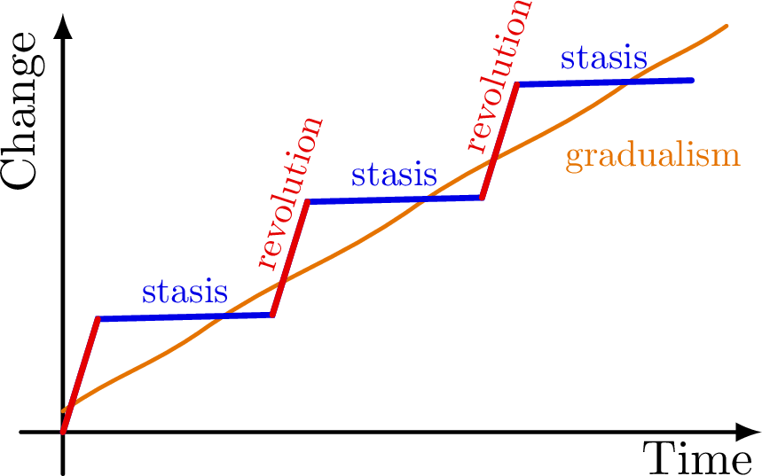
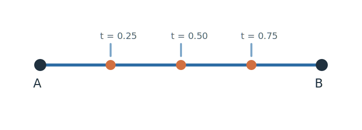

Author: Harsha | Date: 2026-03-25

# Why Lerpit?

*Incremental learning in small chunks is easier and faster than taking a few big leaps.*

Complex systems often evolve through punctuated equilibria. In fact, this seems to come up in biological evolutionary systems[^eldredge], government policies[^policy], deep learning, Earth's climate[^climate], and even in collective human wisdom as a whole. Interestingly, it also appears to be true for a particular neural collective: our individual brains.



I want to justify this website's approach by looking at how this phenomenon impacts learning. You may have noticed this while picking up a new skill. You improve for a while, then enter a phase of apparent stalling where no progress seems to happen. Then, suddenly, there is a burst of eureka that seems to come out of nowhere, followed later by yet another plateau, and so on. This is a classic sign of punctuated equilibrium.

Now, you might ask: *this is interesting, but what does it mean for me?* First, it should reassure you that plateaus are a natural part of learning. You do not need to stress over an apparent lack of progress. Beyond that, my conjecture is that in the BFS-esque branching that takes place in our brain during path exploration toward a new skill, the tighter the feedback loop, the faster we can *detect* and cull incorrect steps and branch in the right direction. Expanding further, this branch exploration phase, where the brain is searching for the right path, manifests as the flat regions in the image above. On the surface, nothing is happening, but underneath, your brain is trying a hundred different things. The eureka moment is when one branch *detects* a valid path in learning, which is manifested as a jump in the graph above. This *detection* mechanism is fueled by **feedback**. And given the BFS-esque nature of any exploration, the penalty of having slow feedback is exponentially damaging. So if you are waiting a couple of days between writing a test and receiving your scores, what you learn from that process is far less than what you would learn from receiving quick, small feedback more often and being guided immediately. Your progress may come in smaller increments, but your plateaus will also become predictably shorter.

In fact, it has been shown independently in pedagogical research that incremental learning in small chunks is usually easier and faster than taking a few big leaps.[^soderstrom]

This site turns that into a method: split complex topics into small, named steps, and move through them one at a time. Desirable difficulties and the Region of Proximal Learning support this idea. If learning a new skill is too much of a challenge, it is easy to get discouraged. The practical target is to challenge the brain by the right amount so that effort produces better long-term learning.[^metcalfe]

[^eldredge]: Niles Eldredge and Stephen Jay Gould, *Punctuated Equilibria: An Alternative to Phyletic Gradualism*, in *Models in Paleobiology*, ed. Thomas J. M. Schopf (San Francisco: Freeman, Cooper, 1972), 82–115.
[^policy]: Frank R. Baumgartner, Bryan D. Jones, and Peter Bjerre Mortensen, *Punctuated Equilibrium Theory: Explaining Stability and Change in Public Policymaking*, in *Theories of the Policy Process*, 3rd ed., ed. Paul A. Sabatier and Christopher M. Weible (Boulder: Westview Press, 2014), 59–103.
[^climate]: Victor Brovkin, Edward J. Brook, John W. Williams, Sebastian Bathiany, Timothy Lenton, Michael Barton, Robert M. DeConto, Jonathan F. Donges, Andrey Ganopolski, Jerry McManus, Summer K. Praetorius, Anne de Vernal, Ayako Abe-Ouchi, Hai Cheng, Martin Claussen, Michel Crucifix, Virginia Iglesias, Darrell S. Kaufman, T. Kleinen, Fabrice Lambert, Sander van der Leeuw, Hannah Liddy, Marie-France Loutre, David McGee, Kira Rehfeld, Rachael H. Rhodes, Alistair W. R. Seddon, Lilian Vanderveken, and Zicheng Yu, “Past abrupt changes, tipping points and cascading impacts in the Earth system,” *Nature Geoscience* 14 (2021): 550–558, https://doi.org/10.1038/s41561-021-00790-5.
[^soderstrom]: Nicholas C. Soderstrom and Robert A. Bjork, *Learning Versus Performance: An Integrative Review* (2015), [doi:10.1177/1745691615569000](https://doi.org/10.1177/1745691615569000).
[^metcalfe]: Janet Metcalfe, *Is Study Time Allocated Selectively to a Region of Proximal Learning?* (2002), [doi:10.1037/0096-3445.131.3.349](https://doi.org/10.1037/0096-3445.131.3.349).

## Let's begin {#start}

Let's familiarize ourselves with the UI. This panel of the player carries the lesson document: prose, math, figures, references, and code samples. The right side keeps one live stage so the lesson can point at a concrete state instead of making you imagine it. As we progress through the lesson, we see how the implementation evolves to achieve our final goal. In one of the future updates, I will add an feature that will challenge users to implement a feature we just learnt and live preview it.

Let's put it to practice by learning about the name of this website. Lerp stands for **L**inear Int**erp**olation. In simple terms, if we move from a point A to point B in a straight line at a constant speed, we are linearly interpolating. This concept is particularly interesting because just by using one parameter (t), we can control how far along this journey we are - 0 means the beginning, and 1 means the end.

$$
\begin{aligned}
\operatorname{lerp}(A, B, t) & = A + t(B - A) \\
& = (1 - t)A + tB
\end{aligned}
$$

Two known points, one parameter, and a line segment traced as that parameter changes. It is enough structure to talk about state, interpolation, and transitions without adding too many moving parts at once.



```c
float lerp_f32(float a, float b, float t) {
  return a + (b - a) * t;
}
```
Let's plug-in different values of `t` into that formula and see how the system evolves.

We begin at `t = 0`. At this point the output is exactly at `A`, because:

$$
\begin{aligned}
\operatorname{lerp}(A, B, 0) & = A + 0 \cdot (B - A) \\
& = A + 0 \\
& = A
\end{aligned}
$$

This is the easiest checkpoint to understand because nothing is hidden yet. The moving point and the anchor coincide, so you can read the rest of the lesson against a stable reference.

## Move to one quarter of the segment {#quarter}

Now let the parameter increase, but only a little.

$$
\begin{aligned}
\operatorname{lerp}(A, B, 0.25) & = A + 0.25(B - A) \\
& = A + \tfrac{1}{4}(B - A) \\
& = \tfrac{3}{4}A + \tfrac{1}{4}B
\end{aligned}
$$

At this stage the relationship between the parameter and the geometry starts to feel concrete. The point has not “jumped somewhere in the middle.” It has moved a quarter of the way from the start toward the end.

```ts
const x = lerp(pointA.x, pointB.x, 0.25);
const y = lerp(pointA.y, pointB.y, 0.25);
```

## Check the midpoint {#midpoint}

The midpoint is the most legible checkpoint in the sequence.

$$
\begin{aligned}
\operatorname{lerp}(A, B, 0.5) & = A + 0.5(B - A) \\
& = A + \tfrac{1}{2}(B - A) \\
& = \tfrac{1}{2}A + \tfrac{1}{2}B \\
& = \frac{A + B}{2}
\end{aligned}
$$

Once the halfway state is obvious, it becomes easier to trust the rest of the parameter range. This is also where interpolation starts to feel like a reusable mental tool rather than a one-off formula.

## Move near the target {#near-target}

With `t = 0.75`, the point has covered most of the distance while still following the same straight path.

$$
\begin{aligned}
\operatorname{lerp}(A, B, 0.75) & = A + 0.75(B - A) \\
& = A + \tfrac{3}{4}(B - A) \\
& = \tfrac{1}{4}A + \tfrac{3}{4}B
\end{aligned}
$$

The lesson here is simple: changing `t` changes where you are on the segment, not what the segment is. The geometry stays the same. Only the selected point changes.

## Finish at B {#finish}

The last checkpoint closes the loop.

$$
\begin{aligned}
\operatorname{lerp}(A, B, 1) & = A + 1 \cdot (B - A) \\
& = A + B - A \\
& = B
\end{aligned}
$$

By the time the point reaches `B`, the full path from start to finish has been explained as one controlled parameter change. Later lerpettes can build on that same idea when the state is more complex than a single point on a line.
