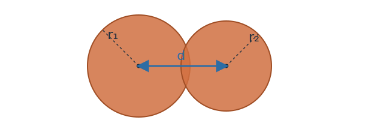

Author: Harsha | Date: 2026-03-25

# Simple body dynamics

This lerpette starts with two of the smallest useful ideas in rigid body simulation:
- a particle
- and it's change of position over time (often called the integration step as we integrate velocity and position over time to find new velocity and position).

## Body Representation {#particle}

Let's begin by defining the body that we are about to simulate. We can consider [the simplest of the particles - a point](https://life.inspirho.com/cg/with-just-one-polka-dot-nothing-can-be-achieved/). Since a point does not really have any dimensions, let's use a sphere to represent a point in this tutorial. One thing worth noting is that generally for rigid-body simulations, we use point particles for the integration step albeit with more properties that what we will end up using for this lerpette.

The sphere particle's properties that are pertinent to what we're building are:
- position - `(x, y)`
- velocity - `(x', y')`
- radius - `r`


## Dynamics {#dynamics}

Now let's see that body move! As a particle moves, it's postion changes based on the velocity it has at that instance. Here is an example of the particle ping-ponging between $-1$ to $1$ on the y-axis. The velocity flips between $(0,1,0)$ to $(0,-1,0)$. This is not driven by forces, it's just integrating the velocity and when the ball reaches the manually defined boundary, the velocity is flipped, hence the change in the direction.

The integration step itself is just this -
$$
x_{t + \Delta t} = x_t + v_t\Delta t
$$


## Accumulated force {#forces}

Let's now look at forces! Forces is a great step towards this feeling like a simulation. Let's add a bunch of smaller spheres all starting from random positions and velocities in a 1x1x1 box and let's apply gravity on it. Let's see what happens!

Here's some theory for how the forces come into the picture. Forces act over time, so they usually change velocity through integration.

$$
v_{t + \Delta t} = v_t + \frac{F}{m}\Delta t
$$

The point of this chapter is just to separate “push over time” from “instant change.” Once that distinction is clear, the rest of the engine starts to organize itself.

The bouncing is implemented similar to the previous step $v_{t+1} = -c_{r} \times v_t$, where $c_r$ is the coefficient of restitution which in this case is `0.95`.


## Collisions {#collisions}

Let's next look at collisions. Idetifying collisions is one of the heaviest step computationally because we need to test every object with every other object if they are colliding. There are ways to speed this up by storing the bodies in clever data structures. We will look into them in a later lesson, and for now, we can start of by simplifying this process - check every sphere with every other sphere and handle the collision.

For this case of spheres, detection and handling of collisions is done like so.

### Detection

If the distance between two spheres is less than the sum of their radii, then they are colliding.



```cpp
bool isColliding(Sphere s1, Sphere s2)
{
    return (s1.pos + s2.pos) < (s1.radius + s2.radius);
}
```

### Handling

If the spheres are colliding, next we need to do two things -
1. correct position - displace the sphere by pushing them out into a non-colliding configuration
2. update the velocities - set the velocities so that they reflect the bouncing

#### Position

Detection only fires once two spheres have *already* overlapped — by the time we react, they're interpenetrating by some amount $\delta = (r_1 + r_2) - d$ along the contact normal $\hat{\mathbf{n}}$. If we only fix velocities and leave the overlap in place, the next frame the spheres are still inside each other, the impulse fires again, and they stick or jitter.

So we push each sphere out along the normal, splitting the correction by inverse mass so the lighter body moves more:

$$
\mathbf{p}_i = \frac{w_i}{w_1 + w_2}\, \delta\, \hat{\mathbf{n}}, \qquad w_i = \frac{1}{m_i}
$$

With equal masses this collapses to splitting $\delta$ in half on each side. Notice how we are *projecting*, not applying a force. We instantaneously teleport the bodies to a non-penetrating state. This is a foreshadowing of the technique we will implement soon in later lessons - PBD/XPBD.

#### Velocity

We break the velocities of both the bodies into two orthogonal components, one along the line connecting their centers (let's call it `normal`), another perpendicular to it. The velocity components that are perpendicular to the `normal` will remain unaffected. The velocity components ($v_1$ and $v_2$) parallel to `normal` will be updated according to these two equations, *momentum* equation (1 below) and *restitution* definition (2 below) to find $V_1$ and $V_2$.

$$
(m_1 \times v_1) + (m_2 \times v_2) = (m_1 \times V_1) + (m_2 \times V_2) \tag{1}
$$
$$
e = \frac{\text{speed of separation}}{\text{speed of approach}} = \frac{V_2-V_1}{v_1-v_2} \tag{2}
$$

We can solve these equations for $V_1$ and $V_2$.
$$
V_1 = \frac{m_1 v_1 + m_2 v_2 - m_2 (v_1 - v_2)e}{m_1 + m_2}
$$

$$
V_2 = \frac{m_1 v_1 + m_2 v_2 - m_1 (v_2 - v_1)e}{m_1 + m_2}
$$

