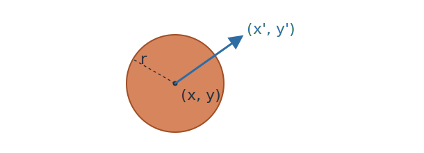

Author: Harsha | Date: 2026-03-25

# Simple body dynamics

This lerpette starts with two of the smallest useful ideas in rigid body simulation:
- a particle
- and it's change of position over time (often called the integration step as we integrate velocity and position over time to find new velocity and position).

## Body Representation {#particle}

Let's begin by defining the body that we are about to simulate. We can consider [the simplest of the particles - a point](https://life.inspirho.com/cg/with-just-one-polka-dot-nothing-can-be-achieved/). Since a point does not really have any dimensions, let's use a sphere to represent a point in this tutorial. One thing worth noting is that generally for rigid-body simulations, we use point particles for the integration step albeit with more properties that what we will end up using for this lerpette.

The sphere particle's properties that are pertinent to what we're building are:
- position - `(x, y)`
- velocity - `(x', y')`
- radius - `r`

## Dynamics {#dynamics}

Now let's see that body move! As a particle moves, it's postion changes based on the velocity it has at that instance. Here is an example of the particle ping-ponging between -1 to 1 on the y-axis. The velocity flips between 0,1,0 to 0,-1,0. This is not driven by forces, it's just integrating the velocity and when the ball reaches the manually defined boundary, the velocity is flipped, hence the change in the direction.

The integration step itself is just this -
$$
x_{t + \Delta t} = x_t + v_t\Delta t
$$

## Accumulated force {#forces}

Let's now look at forces! Forces is a great step towards this feeling like a simulation. Let's add a bunch of smaller spheres all starting from random positions and velocities in a 1x1x1 box and let's apply gravity on it. Let's see what happens!

Here's some theory for how the forces come into the picture. Forces act over time, so they usually change velocity through integration.

$$
v_{t + \Delta t} = v_t + \frac{F}{m}\Delta t
$$

The point of this chapter is just to separate “push over time” from “instant change.” Once that distinction is clear, the rest of the engine starts to organize itself.
